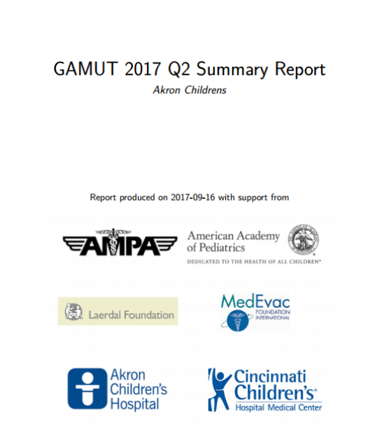
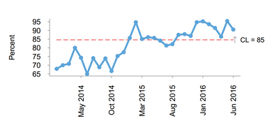

```{r setup, include=FALSE}
#options(htmltools.dir.version = FALSE)
```


# Healthcare Quality

```{r, fig.align = 'center', out.width = "75%", echo = FALSE}


```

---
# Air Medical Transport
source: adamsairmed.org

```{r, fig.align = 'center', out.width = "75%", echo = FALSE}


```

---
# GAMUT QI Collaborative

.pull-left[
### October 2012

- 6 Childrens Hospital programs in Ohio
- Sponsored by AAP (American Academy of Pediatrics)
- 12 pediatric metrics by consensus (Delphi method)
]

.pull-right[
### July 2013

- 68 participants (industry leaders US & Canada)
- 2 day workshop in Denver
- Sponsored by AMPA (Air Medical Physician Association)
- 22 adult metrics
]

```{r, fig.align = 'center', out.width = "75%", echo = FALSE}
knitr::include_graphics("gamut_logo.png")

```

---

# The Challenge

.pull-left[
A simple, inexpensive, secure and scaleable method to: 

1. Collect & manage the raw data 
  -  
1. Analysis 
  -  
1. Publish reports 
  -   
1. Distribution
  -   
1. Dynamic Dashboard
  -  
]
---

# The Challenge

.pull-left[
A simple, inexpensive, secure and scaleable method to: 

1. Collect & manage the raw data 
  - REDCap
1. Analysis 
  - R
1. Publish reports 
  - R Markdown
1. Distribution 
  - R & REDCap
1. Dynamic dashboard 
  - Shiny
]

.pull-right[


]

---

# Reports 


---

# Reports


---

# Reports

.pull-left[

]


.pull-right[


]


---
class: inverse, middle, center

# How it's done


---

# Start with  a parameterized Rmarkdown report

```r  
---
output: html_document
params: 
  carrier: "AA" 
title: "Departure Delay Report for 'r params$carrier'"
---

{r, results = 'asis', echo = FALSE}
source("load_data.R")

carrier_median_delay %>%
    glue_data("At {origin}, 
    the median departure delay for {params$carrier} was 
    {median_dep_delay} minutes.</BR>")
 
kable(carrier_table)
```

---

# Driver script

```{r, echo = FALSE}
head(nycflights13::airlines,4)

```

```{r, eval = FALSE, echo = TRUE}
#' driver.R

data("airlines")

for(i in airlines$carrier) {
    rmarkdown::render("example.Rmd",
                      {{params = list(carrier = i),}}
                      output_dir = "reports",
                      output_file = paste0(i, "_report.html")
                      )
}

```


---

class: center, middle

# Thanks!

Slides created via the R package [**xaringan**](https://github.com/yihui/xaringan).

