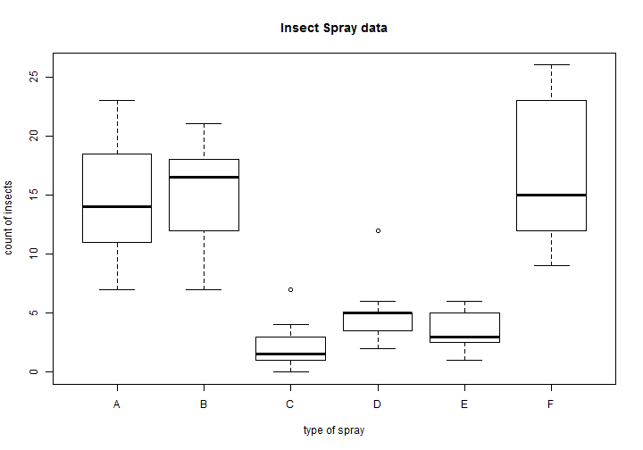
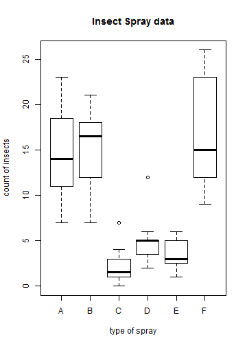

<!-- https://github.com/ajlyons/rpres_css -->
<style>

.reveal h1, .reveal h2, .reveal h3 {
  word-wrap: normal;
  -moz-hyphens: none;
}

.footer {
    color: black; background: #E8E8E8;
    position: fixed; top: 90%;
    text-align:center; width:100%;
}

.small-code pre code {
  font-size: 1em;
}


</style>


RMarkdown & Knitr
===============
author: Rollie Parrish
date: Dec 5, 2014


Overview
===============
- R Markdown used to generate dynamic documents from R
- Depends on:
    - Rmarkdown & knitr packages
    - Pandoc & RStudio


R Markdown
================

### Basic Markdown
- narrative content written in plain text
- basic formatting using a simple syntax
- Markdown is commonly used in web content
    (blogging, Wikipedia content, etc.)

### R code chunks
- incorporates the results of R code

### Rendered into final output
- html / pdf / Word / Presentations (like this one)


Inline Example
================


```r
### Results
2 + 2 = `r 2 + 2`
```


### Results

2 + 2 = 4

Knitr
================

Processes the R Code chunks along with R Markdown to produce final output

"Chuck options" control how the R code is processed.


Example: Graphics
================
```
{r plot1, fig.width=10, fig.align='center'}
```




Example: Graphics
=================
```
{r plot2, fig.width=5, fig.align='right'}
```




A More Elaborate Example
================
class: small-cod

__Question__
Is the percentage of smokers significantly different between groups of patients?

__Data__ The count of patients and the count of smokers.


```r
conf.level <- 0.99
smokers  <- c( 80, 84)#, 129, 90)
patients <- c( 86, 93)#, 136, 120)
```


A More Elaborate Example
================
class: small-code


```r
results <- prop.test(smokers, patients)
results
```

```

	2-sample test for equality of proportions with continuity
	correction

data:  smokers out of patients
X-squared = 0.1456, df = 1, p-value = 0.7028
alternative hypothesis: two.sided
95 percent confidence interval:
 -0.06486486  0.11887836
sample estimates:
   prop 1    prop 2 
0.9302326 0.9032258 
```


A More Elaborate Example
=====================
class: small-code

_results are assigned to variables so we can insert the elements inline_


```r
estimates <- paste(round(results$estimate * 100,1),"%",
                   collapse=" vs. ", sep="")
p_value <- ifelse(results$p.value < .001,
                  0.001, round(results$p.value,3))
p_eq_lt <- ifelse(p_value > .001,
                  "=", "<")
p_sig <- ifelse(p_value > 1-conf.level,
                "not", "")
```

### Results

| p_value|p_eq_lt |p_sig |estimates     |
|-------:|:-------|:-----|:-------------|
|   0.703|=       |not   |93% vs. 90.3% |


A More Elaborate Example
================


```r
This example evaluates the smoking status from `r length(patients)` groups of patients.

Chi-square analysis indicates the proportions of smokers are `r p_sig` significantly different between groups
(`r estimates`, $p$-value `r paste(p_eq_lt, p_value)`).
```


This example includes the smoking status from 2 groups of patients. Chi-square analysis indicates the proportions of smokers are not significantly different between groups (93% vs. 90.3%, $p$-value = 0.703).


Additional Resources
=================

- http://rmarkdown.rstudio.com/

- http://yihui.name/knitr/

- http://shiny.rstudio.com/articles/rmarkdown.html


